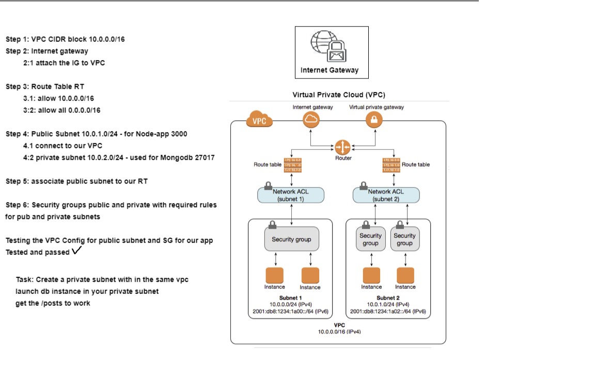

# Cloud Computing
- On-Demand availability of computer system resources - esp. data storage and computing power

## Amazon Web Services (AWS)
- Amazon Web Service
- One of the largest cloud services provider
- Provides a mixture of IaaS, PaaS, and SaaS
### AWS Global Infrastructure

#### AWS Regions
- Locations that the AWS cloud spans
- At least two data centres per region
- Not all regions have all services available
#### AWS Availability Zones (AZs)
- The data centres within each region
#### Advantages of Cloud Computing and AWS
- Go global in minutes
- No need to spend on running and maintaining data centres
- increase speed and agility
- Scalable
- Only pay for what you use
### Public Cloud - Private Cloud and Hybrid Cloud use cases
- IaaS - PaaS - SaaS
- Cloud Data Centres

## AWS Services
- Elastic Compute Cloud `EC2`
  - Web service that provides secure, resizable compute capacity in the cloud
- Simple Storage Service `S3`
  - Object storage service
  - Store and protect any amount of data
  - Good tool for Disaster Recovery Planning
- Elastic Block Store `EBS`
  - Scalable block storage mounted onto the EC2
- Virtual Private Network `VPC`
- Internet Gateway `IG`
- Route Tables `RT`
- Subnet `sn`
- Network Access Control `NALs`
- Security Groups `SG`
- Cloudwatch `CW`
  - A monitoring and management service
- Simple Notification Service `SNS`
- Simple Queue Service `SQS`
- Load Balancers `LB` - `ALB` - `ELB` - `NLB`
- Autoscaling Groups `ASG`
- Amazon Machine Image `AMI`
- Dynamodb - Mongodb

# Steps to Create EC2 Instance
- Go to EC2 dashboard
- Launch instance
## Choose an AMI
- Select Ubuntu Server 16.04 LTS 64-bit (x86) AMI
## Choose an Instance Type
- Select t2 micro instance type
## Configure Instance Details
- Subnet - DevOpsStudent default
- Enable Public IP
## Add storage
- Default
## Tags
- Key: Name; Value: devops_conor_app
## Configure Security Group
- ssh 22 from own IP
- HTTP 80
- App 3000

## ssh debugging
```
eval ssh-agent
ssh-add "keyfile.pem"
```

## Set up App Environment
- Install nginx
```
sudo apt-get update -y
sudo apt-get upgrade -y
sudo apt-get install nginx -y
sudo systemctl restart nginx
sudo systemctl enable nginx
```
- check public IP globally

- Install nodejs and required dependencies
```
sudo apt-get install python-software-properties
curl -sL https://deb.nodesource.com/setup_6.x | sudo -E bash -
sudo apt-get install nodejs -y
sudo npm install pm2 -g
```
- `app code` currently available on `localhost`
- task: `find out how to migrate/transfer/copy data from on prem to cloud`
  - scp
  - or clone git (better)
```
npm install
npm start
```

## Reverse Proxy on App
```
sudo rm -rf /etc/nginx/sites-available/default
sudo cp app/app/default /etc/nginx/sites-available/
sudo systemctl restart nginx
sudo systemctl enable nginx
systemctl status nginx
npm start
```
- default file should be:
```
upstream nodejs {
  server localhost:3000;
  }

  server {
    listen 80;
    location / {
      proxy_pass http://localhost:3000;
      proxy_http_version 1.1;
      proxy_set_header Upgrade $http_upgrade;
      proxy_set_header Host $host;
      proxy_cache_bypass $http_upgrade;
    }
  } 
```
## EC2 Instance for Mongodb
- Security group
  - ssh 22 from own IP
  - port 27017 from app public IP
- Environment
```
# be careful of these keys, they will go out of date
sudo apt-key adv --keyserver hkp://keyserver.ubuntu.com:80 --recv D68FA50FEA312927
echo "deb https://repo.mongodb.org/apt/ubuntu xenial/mongodb-org/3.2 multiverse" | sudo tee /etc/apt/sources.list.d/mongodb-org-3.2.list

sudo apt-get update -y
sudo apt-get upgrade -y

# sudo apt-get install mongodb-org=3.2.20 -y
sudo apt-get install -y mongodb-org=3.2.20 mongodb-org-server=3.2.20 mongodb-org-shell=3.2.20 mongodb-org-mongos=3.2.20 mongodb-org-tools=3.2.20

# remove vm mongod.conf and replace with local version
sudo rm -rf /etc/mongod.conf
sudo cp /home/vagrant/app/environment/db/mongod.conf /etc/

# if mongo is is set up correctly these will be successful
sudo systemctl restart mongod
sudo systemctl enable mongod
```

- Mongod.conf (restart and enable mongod after)
  ```
  # network interfaces
  net:
    port: 27017
    bindIp: 0.0.0.0
  ```

## Connecting App and Mongodb
- In app instance
```
sudo echo 'export DB_HOST="mongodb://dbip:27017/posts"' >> ~/.bashrc
source ~/.bashrc
node app/app/seeds/seed.js
npm start
```

# Creating an EC2 Instance From Our Customised AMI

## Getting the Customised Image
- Save the EC2 instance as an image
- Use same naming conventions for the image

## Creating EC2 instance from the customised AMI
- Click on image and launch
- Enable Public IP
- Can click on select existing security group
- When using ssh command change "root" to "ubuntu"

# Create a CloudWatch alarm for an instance
- Open the Amazon EC2 console
- In the navigation pane, choose Instances.
- Enable detailed monitoring on the instance
- Select the instance and choose Actions, Monitor and troubleshoot, Manage CloudWatch alarms
- On the Manage CloudWatch alarms detail page, under Add or edit alarm, select Create an alarm
- For Alarm notification, choose whether to turn the toggle on or off to configure Amazon Simple Notification Service (Amazon SNS) notifications. Enter an existing Amazon SNS topic or enter a name to create a new topic
- For Alarm action, choose whether to turn the toggle on or off to specify an action to take when the alarm is triggered. Select an action from the dropdown
- For Alarm thresholds, select the metric and criteria for the alarm. For example, you can leave the default settings for Group samples by (Average) and Type of data to sample (CPU utilization) For Alarm when, choose >= and enter 0.80. For Consecutive period, enter 1. For Period, select 5 minutes
- (Optional) For Sample metric data, choose Add to dashboard
- Choose Create

## Setting up SNS

# AWS Monitoring
- Questions to ask
  - What should we monitor?
  - What resources will we monitor
  - How often will we monitor
  - What tools are we going to use to perform these tasks
  - Who will perform the monitoring
  - Who should be notified by the alarm
- Monitoring endpoints
  - Application Server - `EC2`
  - CPU utilisation %
  - Number of requests - REsponse Time - Latency
  - Firewall

## Four Golden Signals of Monitoring
- Latency
  - Time taken to service a request
- Traffic
  - How much demand is being placed on your system
- Errors
  - The rate at which requests fail
- Saturation
  - How full the service is

### Resources Monitored by CloudWatch
- EC2
- Auto-Scaling
- Load Balancer
- Amazon SNS
- Amazon SQS
- Amazon RDS
- Amazon S3
- DynamoDB

### CloudWatch Alarm Actions
- SNS email notification
- Auto-Scaling

## Automating the Processess
- Application Load Balancer `ALB`
- Autoscaling Group
- Launch template config - how many instances at all times
- 2 instances - Min=2 and Max=3
- Policies of scaling out - and scaling in to min=2

### Scaling on Demand
- Scaling up
  - Increasing the size of your instance
- Scaling out
  - Increasing the number of instances

# AWS Simple Storage Servie `S3`
- Object storage service offering scalability, data availability, security, and performance
- Used to store and protect any amount of data
  - Good tool for Disaster Recovery Planning
- S3 Storage Classes:
  - Standard - `S3 Glacier

## To Create AWS CLI:
- Dependencies:
  - python3 with any other requried
- AWS access and secret keys
- S3 access through our IAM role/account
  - apply CRUD: Create - Read- Update - Delete
  
- Data Persistency

- Commands
```
sudo apt-get update
sudo apt-get upgrade -y
sudo apt-get install python -y
sudo apt-get install python-pip -y
sudo pip install awscli -y
sudo apt install python3 -y
sudo apt install python3-pip -y
alias python=python3
sudo pip3 install awscli
aws configure

# see buckets
aws s3 ls

# make bucket
aws s3 mb s3://bucket-name

# copy file to bucket
aws s3 cp path/to/file s3://bucket-name/

# copy file from bucket to ec2
aws s3 cp s3://bucket-name/file directory/on/ec2
# or
aws s3 sync s3://bucket-name/ ec2/new/directory

# delete all files from bucket
aws s3 rm s3://bucket-name --recursive

# delete bucket from aws
aws s3 rb s3://bucket-name
```

### S3 
- `aws se ls` to list buckets
- `aws --version`
- `aws configure` to add our keys and config
- `aws s3 mb s3://name --region name`
- `aws s3 cp s3://name/ file.md`
- `aws s3 cp s3://name/file.md file.md`
- `aws s3 sync s3://bucketname/ test`
- `aws s3 rm s3://bucketname --recursive`
- `aws s3 rb s3://bucketname`

### AWSCLI
- AWSCLI can be used to create any `aws` resources required

# Making App Highly Available

## Autoscaling and Load Balancing
- Automatically adjusts the amount of computational resources based on the server load
- Distributes traffic between EC2 instances to prevent any from being overwhelmed

### Steps
- ASG: Launch Template or configuration
- ALB: Target group HTTP 80
- AWS keys
- VPC - Subnets  - SG
  - Type of Instance
  - AMI-id Node-app AMI
  - EBS storage

### Autoscaling group to launch node app with min 2 desired, 2 max, 3 ec2s, in multi AZs
- Use the user data option to run the script to lauch nodeapp without DB in your first iteration, second iteration connect to DB using DB AMI Cloudwatch to launch autoscaling group

# AWS Netowrking

## Creating a VPC
- Step 1: VPC CIDR block 10.104.0.0/16
- Step 2: Internet gateway
  - 2.1: Attach the IG to VPC
- Step 3: Route Table
  - 3.1: Allow 10.104.0.0/16
  - 3.2: Allow all 0.0.0.0/16
- Step 4 Public Subnet 10.104.1.0/24
  - 4.1 Connect to our VPC
  - 4.2 Private subnets 10.104.2.0/24 - used for Mongodb 27017
- Step 5: Associate public subnet to our RT
- Step 6: Security groups public and private with required rules for public and private subnets



### Testing the VPC for Public Subnet and SG for our APP


### SG rules
- App
  - 80
  - 3000
  - 22 from only your own IP
- DB
  - 27017 from app IP or app sg or 0.0.0.0:27017 (shouldn't allow public access)
  - 27017 from 10.104.1.0/24 IP
  - 22 from only your own IP
 